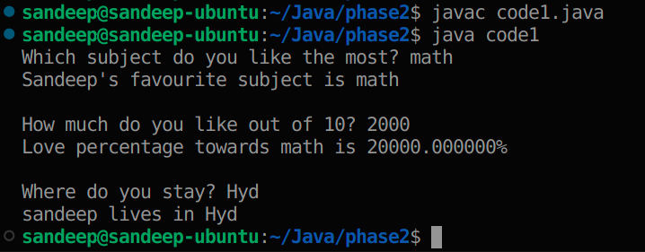

# Java Learning Journey: Phase 2 📈

## Learnings from [code1](code1.java)
* Taking input from the user.
  * importing java.util.Scanner module
  * creating Scanner object
  * nextLine() method 
  * Using print() method instead of println()
  * Do not forget to close the Scanner object :)
  * Using printf() (same as in c++)
  * nextInt() to get integer input
  * nextDouble(), nextFloat()
  * After using nextInt, you can call nextLine once to consume the remaining newline character from the buffer. This ensures the next nextLine call reads the user's complete line input.
  * Output: <br/> 

## Learnings from [code2](code2.java)

* [code2](code2.java) contains code of a simple calculator
* Be careful of the phenomenon of **fall-through** when there is no ```break``` in case block

## Learnings from [code3](code3.java)

* Arrays in java.
* Do not forget to access elements in array using indexing without making sure that index is within bounds.
* length is not a method as in string, it is a property for arrays.
* sort() method in java.util.Arrays package. We can also perform sorting in particular range in an array.
* Arrays.binarySearch()
  * returns
    * index                             (if the key is found)
    * -(insertion_point) -1             (if the key is not found) where insertion_point is the index at which the key would need to be inserted to maintain the sorted order

## Learnings from [code4](code4.java)

* In order to not over populate learnings from a code, I have created this new section in continuation to the [previous section](#Learnings-from-code3)
* ```fill()``` method can be used to fill the entire array with some value (or) filling some value in some specific range.
* int arr2[] = arr1; This line does not create a new copy of the array elements. Instead, it assigns the reference of arr1 to arr2
* ```copyOf(array, length)``` method can be used to create **actual** copies of an array.
* Similarly, ```copyOfRange(arr, startingIndex, endingIndex)``` can be used to copy elements of an array in some range.
* ```equals(arr1, arr2)``` of Arrays in java checks whether the contents of two arrays arr1, arr2 are same (or) not.

## Learnings from [code5](code5.java)

* Though I used loops in previous section (since I know other programming languages while I was learning java :) ), this section is dedicated to 3 kinds of loops
  * **for loop**.
  * **while loop**
  * **do while loop**
* There is another type of accessing elements in a container, which is discussed in [phase3/code2](../phase3/code2.java)